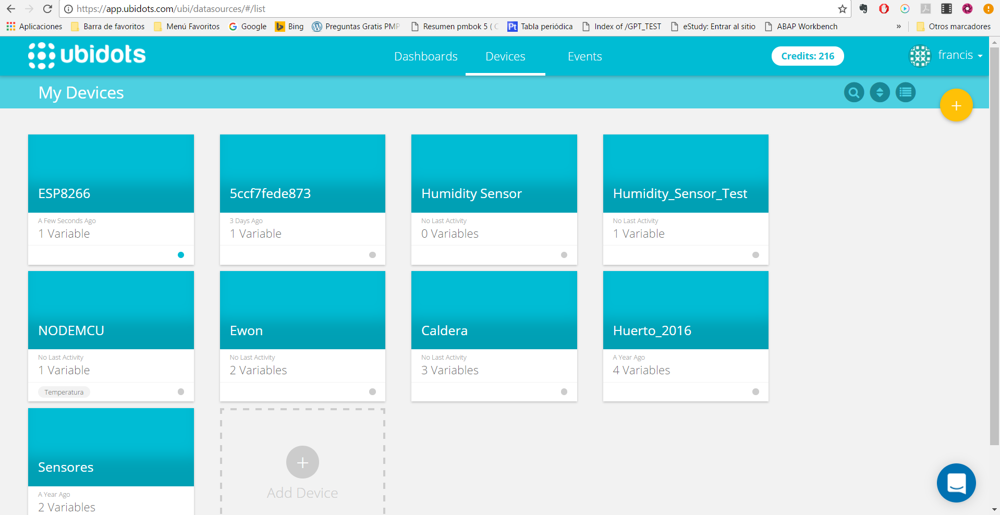

# {ing}tech_it : Visualizando Datos

En esta sección vamos a explicar como interpretar los datos desde Ubidots con la placa encendida enviando datos del sensor.

1. Hacemos login en Ubidots ([Login Ubidots ](https://app.ubidots.com/accounts/signin/))

2. Pulsamos en la pestaña de "Devices" donde podemos observar todos los Devices que tenemos actualmente y podemos observar cual de los dispositivos estan recibiendo datos ya que debajo del dispostivo indica cuanto tiempo hace que ha recibido información.

3. Seleccionamos el "Devices" que estamos usando actualmente o que queremos consultar y nos aparecera una pantalla con todos los sensores conectados a ese dispositivo.

4. Cuando pulsamos en una de las variables de dispositivos podemos ver en tiempo real que datos esta enviando el dispositivo del sensor.

---
Continuar al  [Paso 7](./lineas_futuras.md) o ir al [Indice](./index.md)

