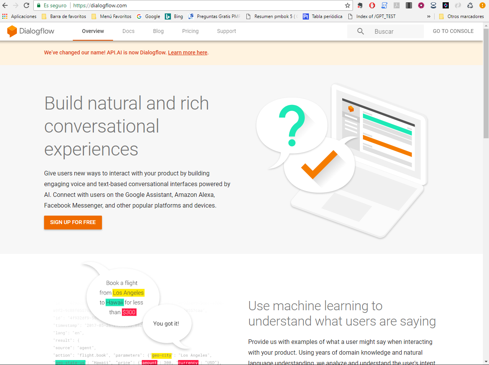
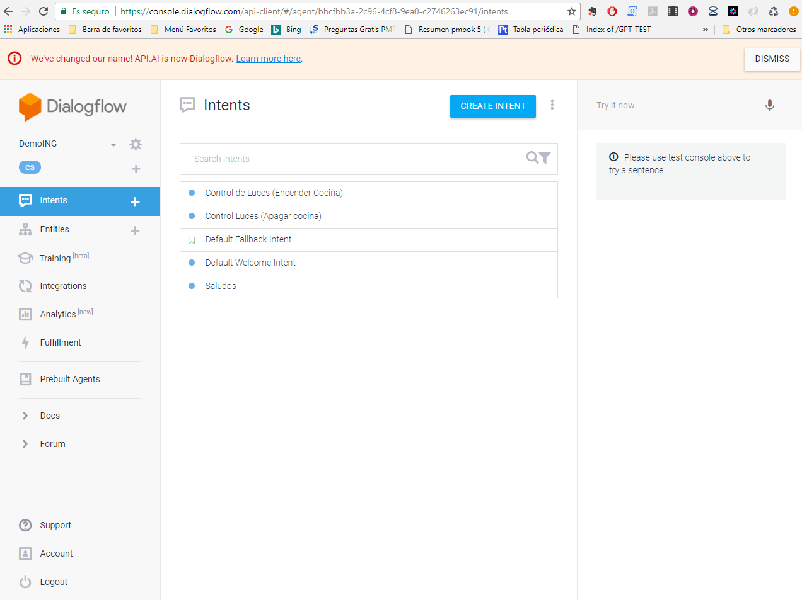
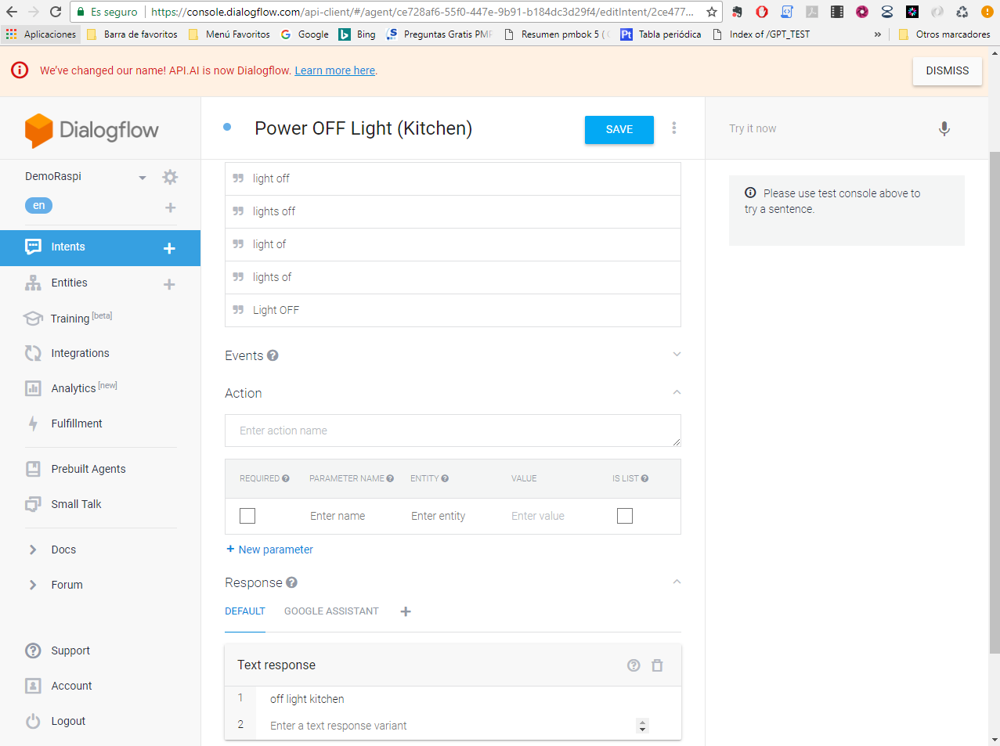
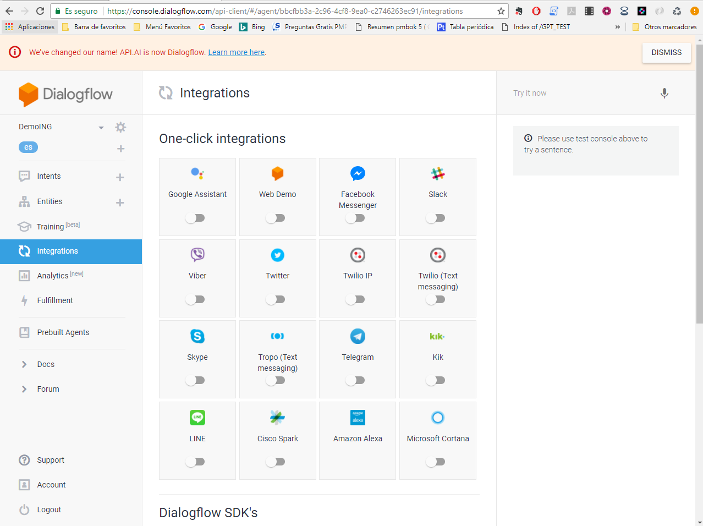
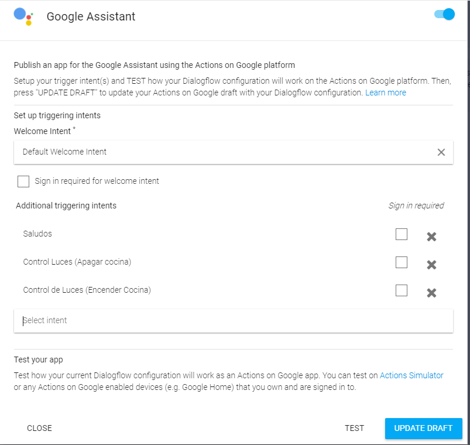
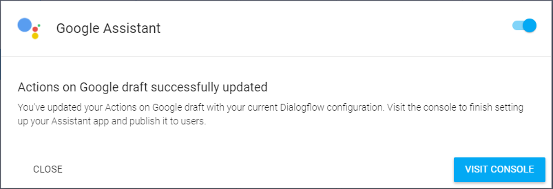
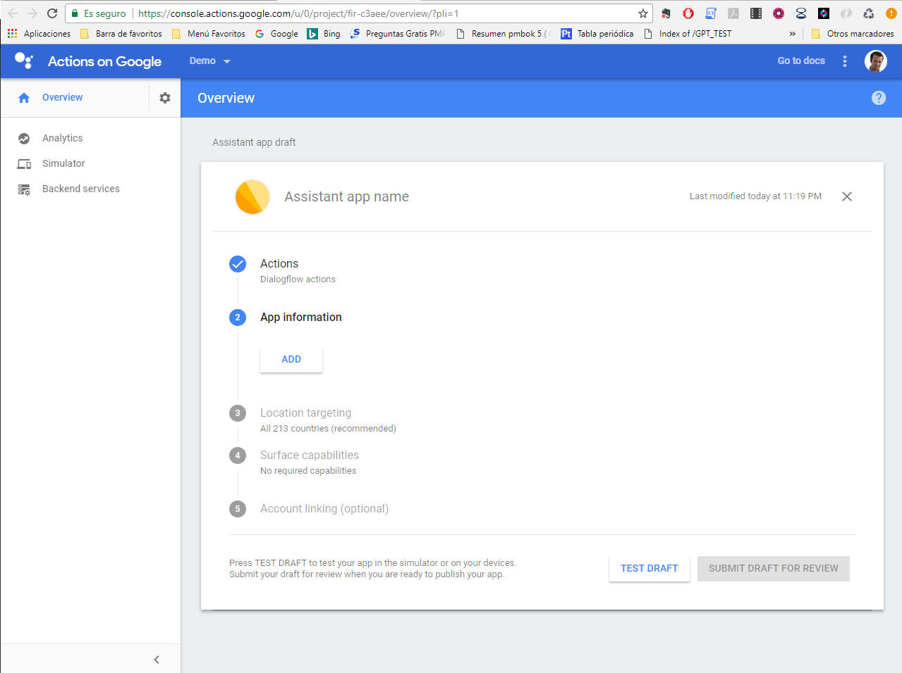

# {ing}tech_it : Creando Dialog Flow y Action Google

Para crear un bot con Dialog Flow vamos a utilizar la misma cuenta de desarrollador que hemos utilizado para el asistente, ya que dicho asistente se conectará al bot a través de una integración con Actions Google.

Nos vamos a la web de [Dialog Flow](https://dialogflow.com/) y creamos un bot con varias intenciones.
1. Entramos en la parte derecha en el botón "GO TO CONSOLE"

2. Creamos un nuevo Agente desde este [enlace](https://console.dialogflow.com/api-client/#/newAgent)

3. Creamos nuevas intenciones, con sus preguntas y respuestas, que luego recibiremos en la Raspberry Pi cuando la conectemos con este bot:

Ejemplo de intencion de apagar la luz:

4. Integramos el bot con Google Assistant através de un Actions on Google. Para ello debemos crear un Actions on Google con un nombre con el que lo invocaremos. Una vez invocado nos podremos comunicar con nuestro bot a través de Google Assistant instalado en la Raspberry Pi.

a.	En el bot seleccionamos la pestaña "Integration" y seleccionamos la primera opción de integrar con Google Assistant:

b.	Seleccionamos la opción Google Assistant y nos aparecerá una nueva pantalla en la que indicaremos todas las intenciones del bot que puede usar la Actions on Google que vamos a crear. Para ello, clickamos abajo a la derecha la opción "UPDATE DRAFT" (una vez que hemos seleccionado todas las Intenciones que le hemos enseñado a nuestro bot). Es muy importante tener en cuenta que, actualmente (25/10/17), el Actions Google no soporta bot con el lenguaje en Español, por lo que nuestro bot tiene que desarrollarse en Inglés. 

Una vez hemos integrado el Actions Google correctamente con nuestro bot, nos aparecerá esta pantalla para que lo creemos (debemos ir a la consola para crearlo).

5.	Una vez ya en la consola del [Actions Google] procedemos a crear la acción que nos permitirá conectar nuestro Google Assistant con nuestro bot, ya que para ser utilizado deberemos invocar nuestra Actions con un nombre caracteristico. En mi caso le he llamado "talk pi".

Una vez la hemos creado, podemos hacer pruebas de cómo se comunica con nuestro bot y responde a las preguntas que hacemos por el google assistant.

--------
Continuar al  [Paso 6](./montando_circuito.md) o ir al [Indice](./index.md)
