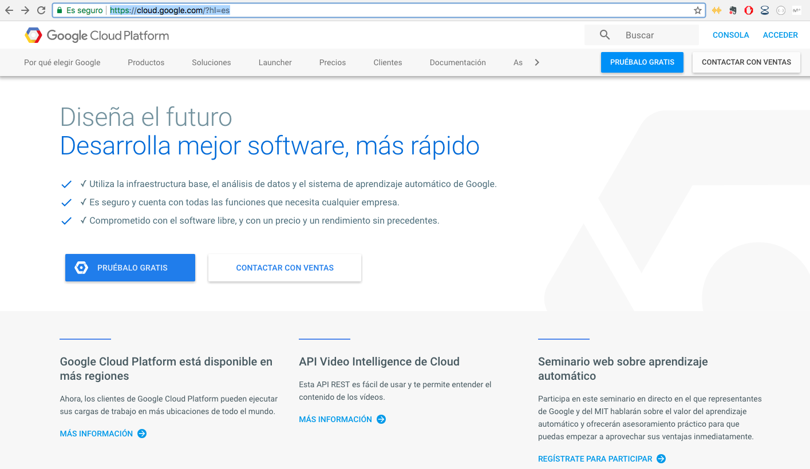
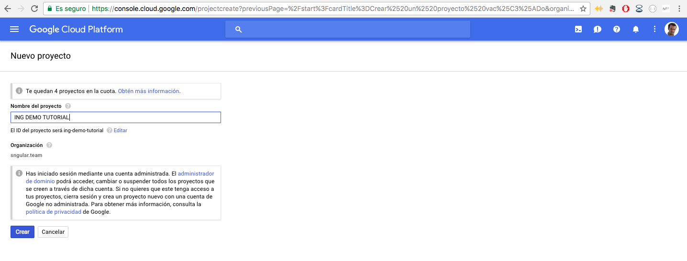
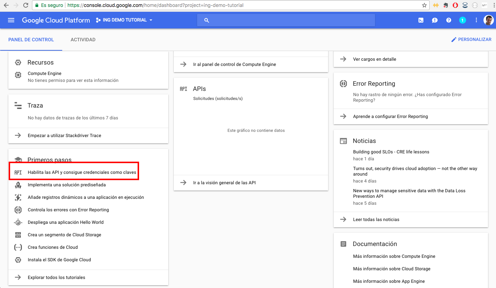
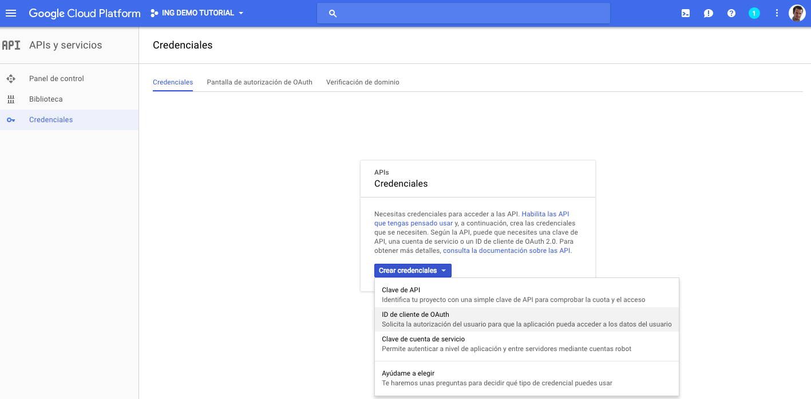
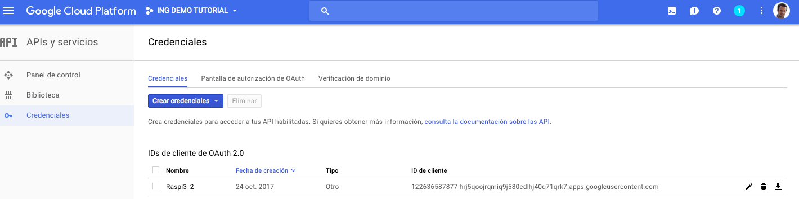
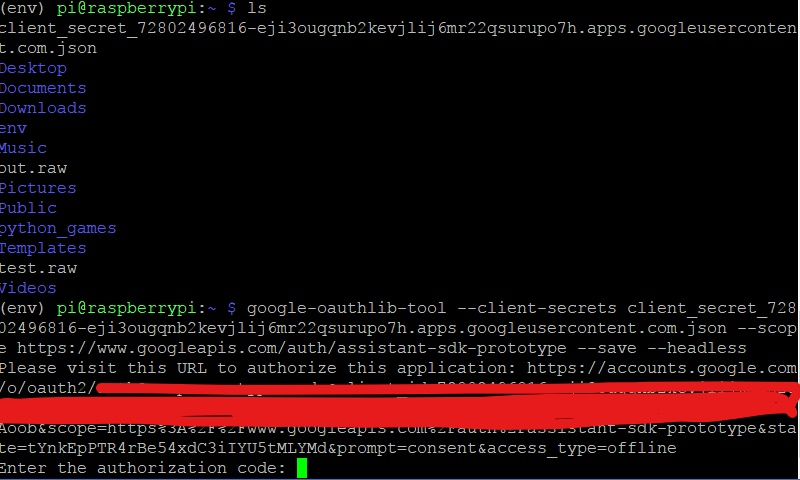
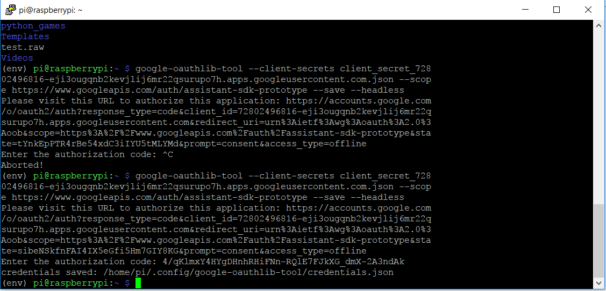

# {ing}tech_it : Instalación SDK Google Assistant API

Una vez nos hemos conectado por ssh a nuestra Raspberry Pi, ya estamos en situación de poder instalar el SDK de Google Assistant para Python en nuestra Raspberry Pi.

Antes de instalar dicho SDK es aconsejable crear una cuenta gratuita de Google para desarrolladores en Google Cloud Platform. Utilizamos una cuenta de correo gmail para todos los procesos de conectar la Raspberry Pi con nuestro bot y nuestra aplicación creada en Actions on Google (ya integrada con nuestro bot). Para crear dicha cuenta podeis ir a este [enlace](https://cloud.google.com/?hl=es)

Una vez que hemos creado la cuenta procedemos a instalar el SDK de Google Assistant para Python.

1. Autorizar a nuestra Raspberry Pi con nuestra cuenta de desarrollador.

1.1 Creamos un nuevo proyecto o seleccionamos uno ya existente [enlace](https://console.cloud.google.com/start)

1.2 Habilitamos las credenciales de la API

Una vez habilitada la API nos vamos a la pestaña credenciales en la pestaña "Credenciales" y creamos una credencial para nuestra Raspberry Pi (que sea única).

1.3 Descargamos el fichero json con las credenciales y lo guardamos en la raiz de la raspberry pi, en el directorio "home/pi", lo podemos pasar por scp con este comando desde nuestro ordenador a la raspberry pi.

~~~
scp ~/Downloads/client_secret_client-id.json pi@raspberry-pi-ip-address:/home/pi/
~~~

[+AYUDA](https://developers.google.com/assistant/sdk/develop/python/config-dev-project-and-account)

2. Instalación del SDK de Google Assistant API para Python 3

Instalamos Python 3 y un entorno virtual (entorno virtual no es obligatorio)

~~~
sudo apt-get update
sudo apt-get install python3-dev python3-venv # Use python3.4-venv if the package cannot be found.
python3 -m venv env
env/bin/python -m pip install --upgrade pip setuptools
source env/bin/activate
~~~

Instalamos la librería del google assistant

~~~
(env) $ python -m pip install --upgrade google-assistant-library
~~~

3. Probamos el ejemplo que nos proporciona google en la documentación (Dentro de la Raspberry Pi y dentro del entorno. Si no aparece (env), debes lanzar el comando "source env/bin/activate" para entra dentro del entorno)

3.1. Abrimos un navegador y entramos con la cuenta que hemos creado la cuenta de desarrollador [enlace](https://developers.google.com/assistant/sdk/develop/python/config-dev-project-and-account#set-activity-controls).

3.2. Autorizamos a nuestra Raspberry Pi con Google Assistant SDK
a. Instalamos la herramienta de autorización dentro de nuestro entorno virtual (env):
~~~
(env) $ python -m pip install --upgrade google-auth-oauthlib[tool]
~~~

b. Lanzamos la herramienta y le pasamos el fichero json que hemos guardado en la Raspberry Pi:

~~~
(env) $  google-oauthlib-tool --client-secrets /path/to/client_secret_client-id.json --scope https://www.googleapis.com/auth/assistant-sdk-prototype --save --headless
~~~

c. Despues de lanzar el comando anterior nos devolvera una url que copiamos y pegamos en cualquier navegador. Obtendremos un código que debemos pegar a continuación de la url que nos generó el comando anterior.

d. Lanzamos la demo (si todo lo anterior ha ido bien):

~~~
(env) $  google-assistant-demo
~~~

e. Decimos "OK Google" cerca del microfono de la raspberry pi. Nos debe responder el asistente por el altavoz.

[+AYUDA](https://developers.google.com/assistant/sdk/develop/python/run-sample)
--------
Continuar al  [Paso 5](./creando_dialog_flow_y_action_google.md) o ir al [Indice](./index.md)
