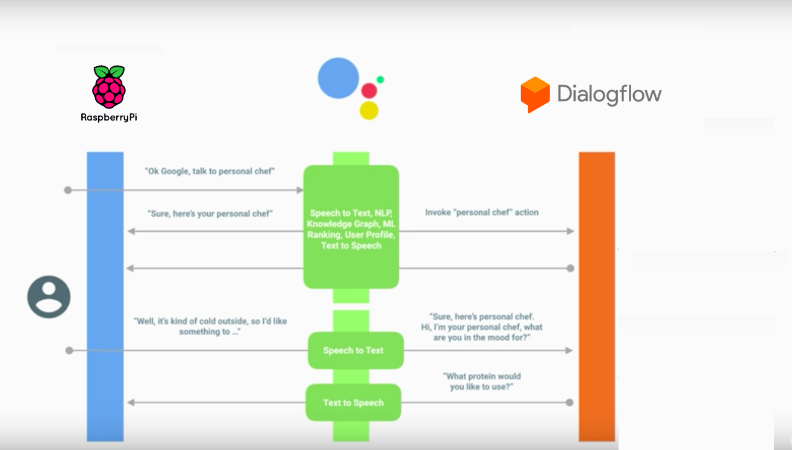

# {ing}tech_it : Introducción

Para desarrollar este taller vamos a seguir una arquitectura que nos permitirá interactuar con la lámpara conectada a nuestra Raspberry Pi a través del asistente de voz Google Assistant

--------
Continuar al  [Paso 3](./configuracion_raspberry.md) o ir al [Indice](./index.md)
