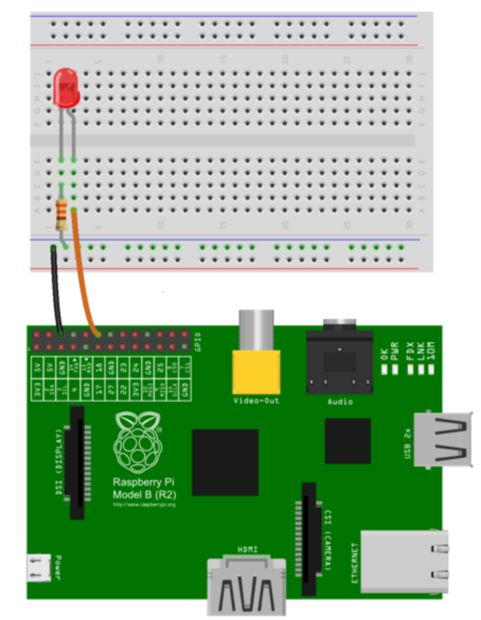

# {ing}tech_it : Montando Circuito

## Montaje del circuito

Para el montaje de circuito, desconectamos la Raspberry Pi de la red electrica y seguimos este esquema:

Debemos tener en cuenta que la lámpara LED tiene dos patillas, una más corta que va conectada a una patilla de la resistencia, y otra más larga que va conectada al cable del puerto GPIO18 de la Raspberry Pi.

## Configurar código en la Raspberry Pi para controlar el LED con Google Assistant

Después de montar el circuito, encendemos la Raspberry Pi y accedemos a ella a través de ssh (protocolo que facilita las comunicaciones seguras entre dos sistemas) Una vez dentro vamos a seguir los siguientes pasos:

1.	Accedemos al entorno virtual que habiamos creado con el siguiente comando:

~~~
source env/bin/activate
~~~ 

2.	Dentro del entorno virtual vamos a instalar la librería para controlar los puertos GPIO de la raspberry pi con python. Para ello instalamos esta librería:

~~~
(env) $ pip install RPi.GPIO
~~~ 

3.	Ahora nos bajamos el código de prueba que tiene google y probamos el script en python que permite encender y apagar el led cuando decimos 'OK Google' al asistente:

~~~
(env) $ git clone https://github.com/googlesamples/assistant-sdk-python
(env) $ cp -r assistant-sdk-python/google-assistant-sdk/googlesamples/assistant/library new-project
~~~

4.	Una vez que hemos visto que todo ha funcionado bien, vamos a modificar un poco el código y vamos a controlar el led con nuestra aplicación y con nuestras respuestas:

a.	Creamos un script en python basándonos en el ejemplo que nos ha dado Google que hemos personalizado. Lo importante del código es entender cómo se autentifica y cómo pasamos al método de processing las variables 'event' y 'assistant' para procesar lo que ha hablado el usuario a la raspberry pi.

~~~
#!/usr/bin/env python

# Copyright (C) 2017 Google Inc.
#
# Licensed under the Apache License, Version 2.0 (the "License");
# you may not use this file except in compliance with the License.
# You may obtain a copy of the License at
#
#     http://www.apache.org/licenses/LICENSE-2.0
#
# Unless required by applicable law or agreed to in writing, software
# distributed under the License is distributed on an "AS IS" BASIS,
# WITHOUT WARRANTIES OR CONDITIONS OF ANY KIND, either express or implied.
# See the License for the specific language governing permissions and
# limitations under the License.

from __future__ import print_function

import argparse
import os.path
import json
import RPi.GPIO as GPIO
import time

import google.oauth2.credentials

from google.assistant.library import Assistant
from google.assistant.library.event import EventType
from google.assistant.library.file_helpers import existing_file

#Procesamos lo que la información que ha recogido el asistente de google y emitimos una respuesta
def process_event(event, assistant):
    """Pretty prints events.

    Prints all events that occur with two spaces between each new
    conversation and a single space between turns of a conversation.

    Args:
        event(event.Event): The current event to process.
    """
    print(event)

    if event.type == EventType.ON_RECOGNIZING_SPEECH_FINISHED:
        speech_text = event.args["text"]
        print("speech text: " + speech_text)
        GPIO.setup(18,GPIO.OUT)
        if(speech_text == 'light off' or speech_text == 'lights off' or speech_text == 'light of'
            speech_text == 'lights off' or speech_text == 'light of' or speech_text == 'lights of'
            or speech_text == 'Light OFF'):
            print("------------")
            print("------------")
            print("Apaga la luz")
            print("------------")
            print("------------")
            GPIO.output(18,GPIO.LOW)
        if(speech_text == 'light on' or speech_text == 'lights on' or speech_text == 'Light ON'):
            print("------------")
            print("------------")
            print("Enciende la luz")
            print("------------")
            print("------------")
            GPIO.output(18,GPIO.HIGH)

def main():
    #Autentificamos nuestra raspberry pi con nuestras credenciales
    parser = argparse.ArgumentParser(
        formatter_class=argparse.RawTextHelpFormatter)
    parser.add_argument('--credentials', type=existing_file,
                        metavar='OAUTH2_CREDENTIALS_FILE',
                        default=os.path.join(
                            os.path.expanduser('~/.config'),
                            'google-oauthlib-tool',
                            'credentials.json'
                        ),
                        help='Path to store and read OAuth2 credentials')
    args = parser.parse_args()
    with open(args.credentials, 'r') as f:
        credentials = google.oauth2.credentials.Credentials(token=None,
                                                            **json.load(f))

    #Establecemos el canal de comunicación entre el Google Assistant y el usuario de la Raspberry Pi
    with Assistant(credentials) as assistant:
        for event in assistant.start():
            process_event(event, assistant)

if __name__ == '__main__':

    #Inicializamos el puerto GPIO 18 que es el que usaremos
    GPIO.setmode(GPIO.BCM)
    GPIO.setwarnings(False)
    GPIO.setup(18,GPIO.OUT)
    main()

~~~

## Pasos para probar la demo

1.	Arrancamos el Script en python
2.	Establecemos comunicación con el servidor de Google con "OK Google"
3.	Invocamos la Actions on Google que nos conecta con nuestro bot. En mi caso era "talk pi". Recordemos que Actionson Google no admite aún Español y debemos hablar en Inglés.
4.	Indicamos a la Raspberry qué queremos hacer: en mi caso, encender la luz. Para ello digo: "light on". Y se debe encender la luz si me ha entendido.
5.	Apago la luz diciendo: "light off". Y se debe apagar la luz si me ha entendido.
6.	Finalmente me despido del Google Assistant con "Goodbye"

--------
Continuar al  [Atrás](./creando_dialog_flow_y_action_google.md) o ir al [Indice](./index.md)
