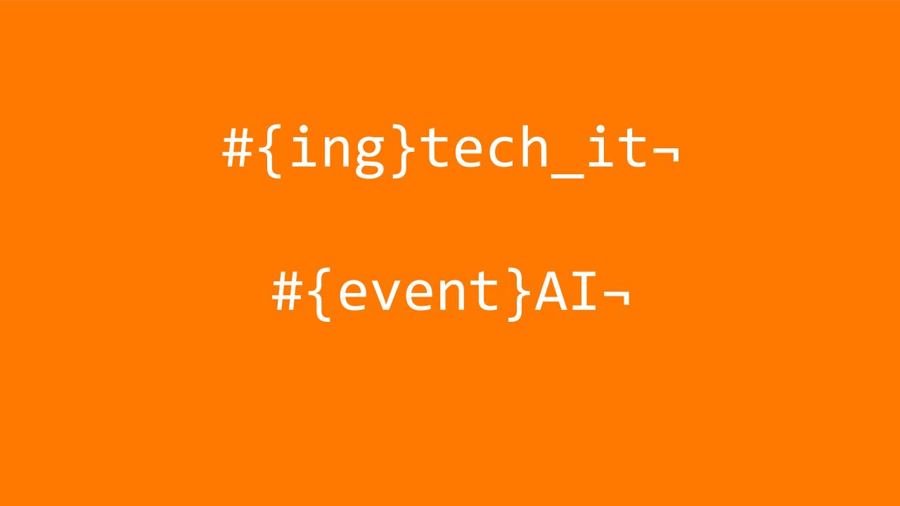

Este taller permite al alumno controlar un led conectado a una raspberry pi a través de la voz.

Para ello, el alumno utilizara varios sistemas, en un principio, creará un bot con el servicio de inteligencia artificial de google llamado dialogflow.

Una vez creado el bot creará una aplicación con Actions Google que integrará con el bot creado.

Finalmente instalará el SDK de Google Assistant para Python en la Raspberry Pi, configurando la Raspberry Pi para poder interactuar con el bot a través de un script creado en Python utilizando el SDK instalado. 

[Comenzamos](./index.md)

